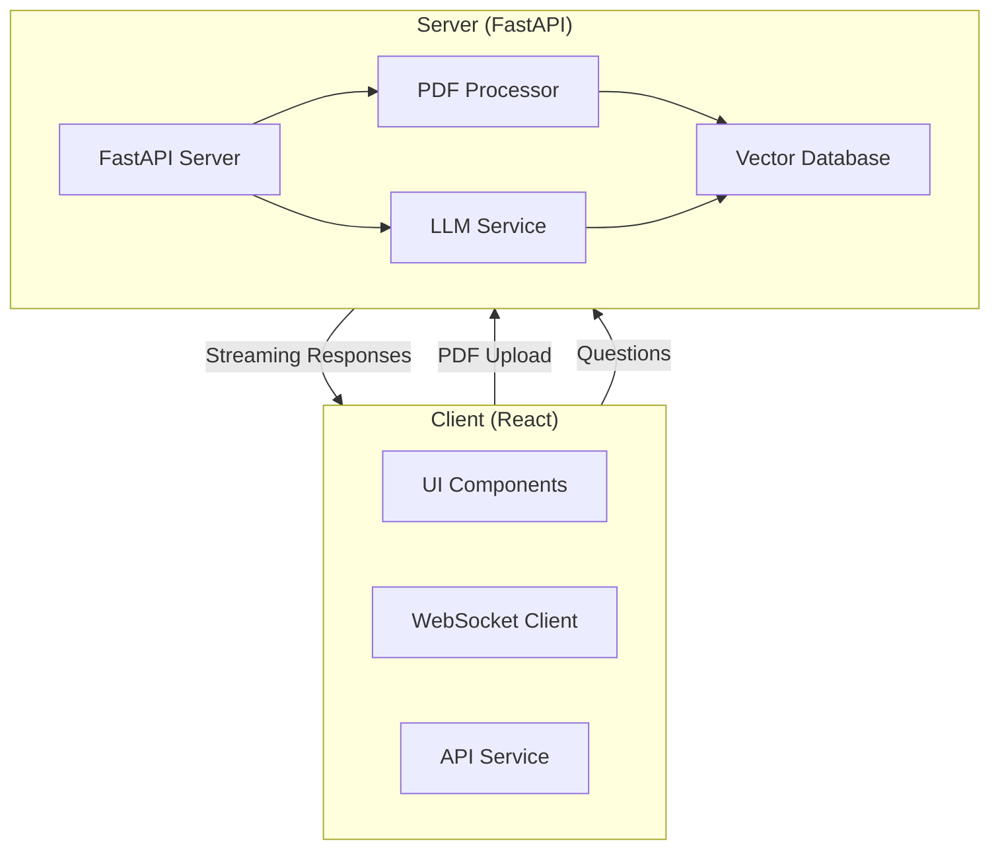
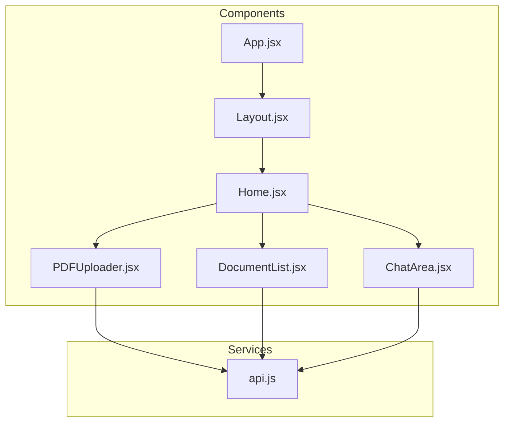
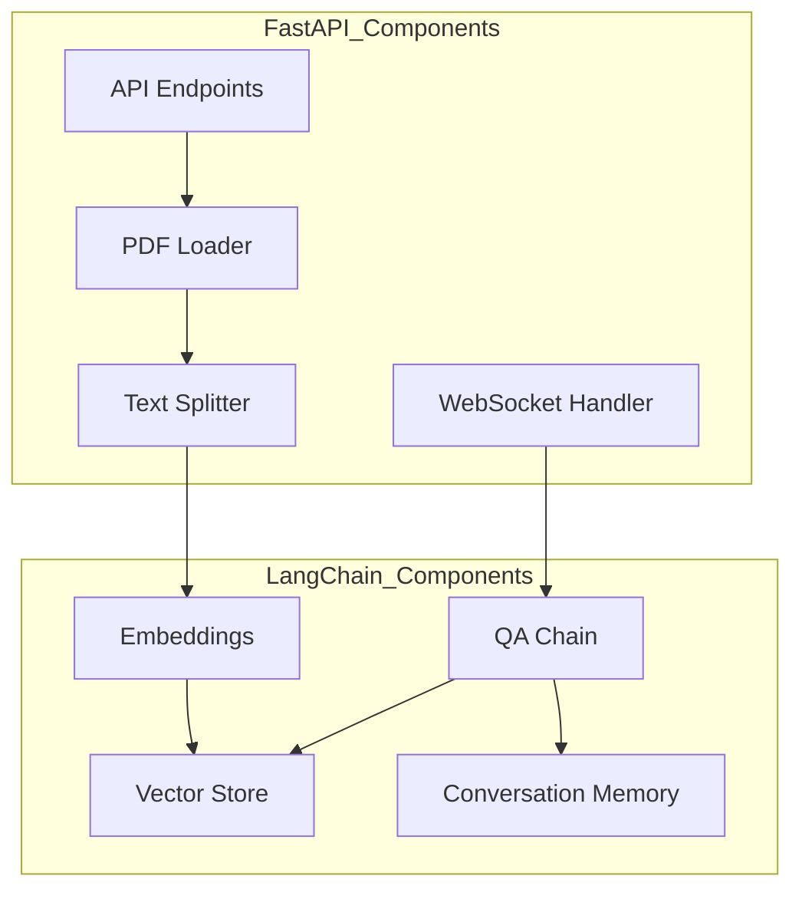

# PDF Bot - Technical Documentation

## High Level Design (HLD)

### System Architecture


### Key Components
1. **Client Application**
   - React-based frontend with Material-UI
   - WebSocket integration for real-time chat
   - PDF document management interface
   - Responsive chat interface with markdown support

2. **Server Application**
   - FastAPI backend server
   - PDF processing and text extraction
   - Vector database for document storage
   - LLM integration for question answering
   - Real-time communication handling

## Low Level Design (LLD)

### Client Architecture


### Server Architecture


## Code Architecture Overview

### Frontend Components

1. **App.jsx**
   - Root component
   - Theme provider and routing setup
   - Dark/light mode management

2. **Layout.jsx**
   - Application shell
   - Header and footer components
   - Theme toggle functionality

3. **Home.jsx**
   - Main page layout
   - Component organization and responsive design

4. **PDFUploader.jsx**
   - PDF file upload handling
   - Upload status management
   - Error handling and feedback

5. **DocumentList.jsx**
   - Displays uploaded documents
   - Real-time document list updates
   - Document selection interface

6. **ChatArea.jsx**
   - Chat interface implementation
   - WebSocket connection management
   - Message history and streaming responses
   - Markdown rendering for responses

### Backend Components

1. **FastAPI Server (main.py)**
   - REST API endpoints
   - WebSocket endpoint for chat
   - PDF processing pipeline
   - LangChain integration

2. **Vector Database**
   - ChromaDB implementation
   - Document storage and retrieval
   - Vector similarity search

3. **LLM Integration**
   - Google Gemini model integration
   - Context-aware response generation
   - Conversation memory management

### Data Flow

1. **PDF Upload Flow**
   ```mermaid
   sequenceDiagram
       Client->>Server: Upload PDF
       Server->>PDFProcessor: Process PDF
       PDFProcessor->>TextSplitter: Split Text
       TextSplitter->>Embeddings: Generate Embeddings
       Embeddings->>VectorDB: Store Vectors
       Server->>Client: Upload Confirmation
   ```

2. **Chat Flow**
   ```mermaid
   sequenceDiagram
       Client->>Server: WebSocket Connection
       Client->>Server: Send Question
       Server->>VectorDB: Retrieve Context
       Server->>LLM: Generate Response
       Server-->>Client: Stream Response
   ```

### Key Technologies

1. **Frontend**
   - React 19.0
   - Material-UI v7
   - WebSocket for real-time communication
   - Axios for HTTP requests
   - Tailwind CSS for styling

2. **Backend**
   - FastAPI
   - LangChain for document processing
   - Google Gemini 2.0 Flash
   - ChromaDB for vector storage
   - WebSockets for bidirectional communication

### Security Considerations

1. **Client-side**
   - Input validation
   - File type restrictions
   - Error handling

2. **Server-side**
   - CORS configuration
   - Rate limiting (to be implemented)
   - File size restrictions
   - Secure WebSocket connections